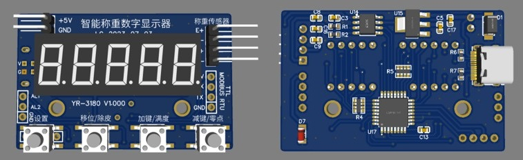
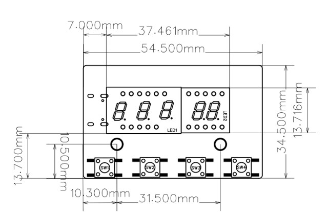
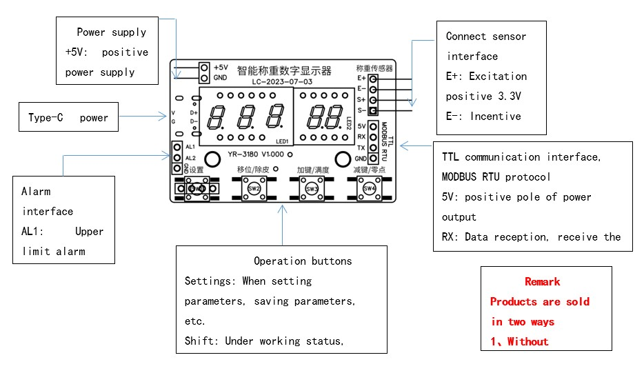

# YR-3180 Device Manual

## General Description

YR-3180 weighing module is a high-performance multifunctional electronic weighing equipment. It uses advanced weighing sensor technology to measure the weight of objects in real time and display it on a five-digit digital tube. In addition, it has upper and lower limit alarm functions. It is capable of achieving accurate weighing control and monitoring. This product also has a TTL communication interface and MODBUS RTU communication protocol, which enables fast and convenient communication with PLC computers and other equipment for remote transmission and control of weighing data. In addition, it supports USB Type-C power supply and button debugging functions, improving the convenience and stability of use.

### Main Features

- High precision weighing sensor that allows accurate weight detection and display.
- Five-digit digital tube display, intuitive and clear, suitable for high-speed weighing processes.
- Upper and lower limit alarm functions facilitate early warnings and strict control to improve quality.
- Support TTL communication interface and MODBUS RTU protocol for fast and convenient data transmission and remote control.
- USB Type-C/5V powered and button debugging function, easy to use and with high stability.
- Lightweight and portable, easy to install and move, saving space and cost.

## Dimensions

## Wiring

**Power:**
- +5V: Input
- GND: Ground

**Sensor connections:**
- E+: Positive excitation 3.3V
- E-: Negative excitation GND
- S+: Positive signal
- S-: Negative signal

**USB Type-C power interface**

**TTL communication interface and MODBUS RTU protocol:**
- 5V: 5V power output
- RX: Receiving data (connect to TXD from the other party)
- TX: Transmitted data (connect to RXD from the other party)
- GND: Ground

**Alarm interface:**
- AL1: Upper limit alarm
- AL2: Lower limit alarm
- GND: Ground

## General Parameters

| Nº | Symbol | Limits | Description | Default value |
|-------------|---------|------------------|-------------|-----------------------------|
| 1           | Lock    | 0-99999          | Press the SEL key for setting, the display window will show LOCK and then 1230. Only after switching to 1231 can the following parameters be entered. | 1230 |
| 2           | dot     | 0.0 0.00 0.000   | The 20kg sensor can be set with 3 decimal points 20.000kg The 200kg sensor can be set with 2 decimal points 200.00kg The 2000kg sensor can be set with 1 decimal point 2000.0kg | 0.0 |
| 3           | LB      | 0-40             | 0-No processing 1 to 40 times of average filtering sampling, the larger the setting value, the better the filtering effect but the speed will be slower. | 5 |
| 4           | Ad-H    | 01               | Harvesting speed: 0 low speed 1 fast | 0 |
| 5           | CLr     | 0-999.9          | The tare and tare range are cleared at power on. When this parameter is greater than zero, the meter will automatically clear and tare within this range at power on. | 5 |
| 6           | Fd      | 1 2 5 10 20 50 100 200 | Optional graduation values: 1 2 5 10 20 50 100 200 | 1 |
| 7           | ZEro    | 0-9999           | Zero tracking range, automatic tracking of weighing at near zero point to keep gross weight display at zero. Note: Automatic clearing is invalid in automatic mode. | 10 |
| 8           | Zt      | 10.0-600.0       | Zero tracking time, unit in seconds, the factory default is 10 seconds. For example: after the weight value is stabilized, there will be no change in the value. After 10 seconds it will be automatically cleared. After the value changes, restart the timer. | 60.0 |
| 9           | FSET    | 0.1000-9.9999    | Correction coefficient display value = display value × 1.0000 | 1.0000 |

## Alarm Parameters

| Nº | Symbol | Limits | Description | Default value |
|-------------|---------|------------------|-------------|-----------------------------|
| 01          | LoCK    | 0-9999           | Press the SEL key for setting, the display window will show LOCK and then 1230. Only after switching to 1232 can the following parameters be entered. | 1230 |
|             | AL      | PVL PVH PVHL OFF | PVL: Both AL1 and AL2 are lower limit alarms. If the measured value is lower than the lower limit, the relay will close. PVH: Both AL1 and AL2 are upper limit alarms. If the measured value is higher than the upper limit, the relay will close. PVHL: AL1 is the upper limit alarm, AL2 is the lower limit alarm OFF: Turn off the alarm function | PVHL |
| 1           | AL1     | -1999.9-9999.9   | Upper limit alarm setting value AL1. When the measured value exceeds (50.0) the relay will operate. When the measured value is less than 45.0 AL1 will be disconnected. | 50.0 |
| 2           | AH1     | -1999.9-9999.9   | Upper limit alarm return value. | 5.0 |
| 3           | AL2     | -1999.9-9999.9   | Upper limit alarm setting value AL2. When the measured value exceeds (150.0) the relay will operate. When the measured value is less than 145.0 AL1 will disconnect. | 150.0 |
| 4           | AH2     | -1999.9-9999.9   | Upper limit alarm return value. | 5.0 |

## Communication Parameters

| Nº | Symbol | Limits | Description | Default value |
|-------------|---------|------------------|-------------|-----------------------------|
| 01          | LoCK    | 0-9999           | Press the SEL key for setting, the display window will show LOCK and then 1230. Only after switching to 1233 can the following parameters be entered. | 1230 |
| 02          | Addr    | 001-255          | Modbus address | 001 |
| 03          | Baud    | 1200-115200kbps  | Baudrate | 9600 |
| 04          | Pari    | None             | None: No parity Odd: Odd parity Even: Even parity | 8N1 |
| 05          | Foalot  | 1234 2134 3412 4321 | Data sequence: 12345678 42CAFB10; Data sequence: 34127856 CA4201FB; Data sequence: 56781234 FB1042CA; Data sequence: 78563421 10FBCA42. | 123 |

## Sensor Calibration

Sensor calibration:
1. Press and hold the minus key, do not place weight on the sensor, press the set key to change the value to 0. Press Set again to complete the zero point calibration.
2. To calibrate the full scale, hold down the plus key, place the weight on the sensor, press the set key to change the value to the corresponding weight, and press Set again to complete the full scale calibration.

| Step | Action | Description |
|------|--------|-------------|
| 1    | AD     | Press and hold the minus key, do not place weight on the sensor, press the set key to change the value to 0. Press Set again to complete the zero point calibration. |
| 2    | PL     | Enter the weight value corresponding to the zero point code value. There was no weight on the sensor at this time so the value is set to. |
| 3    | -END-   | Displaying END indicates that the calibration is complete and will automatically return to the working state. |

| Step | Action | Description |
|------|--------|-------------|
| 1    | AD     | To obtain the full scale AD sampling value a weight must be placed on the sensor. After waiting 2 seconds press the setup button to save the full scale encoding value. (More than 20% of the sensor range) |
| 2    | PH     | Enter the weight value corresponding to the full scale code value. This value will be set to the weight placed on the sensor. Press the setting button to save. |
| 3    | -END-   | Displaying END indicates that the calibration is complete and will automatically return to the working state. |

# Configuration for a 20 kg cell

## Introducion
This tutorial explains how to set up a 20kg load cell on the YR-3180 weighing device. Make sure to follow each step carefully for proper setup.

## Necessary Materials
- YR-3180 device
- 20kg load cell
- Power supply (USB Type-C)
- Proper wiring
- MODBUS RTU communication software

## Configuration Steps

### 1. Hardware Connection
Connect the load cell and other components to the YR-3180 following the wiring instructions.:

- **Power:**
  - Connect power supply to USB Type-C connector

- **Sensor connections:**
  - E+: Positive excitation
  - E-: Negative excitation
  - S+: Positive signal
  - S-: Negative signal

### 2. Device Configuration
Follow these steps to configure the device parameters:

#### General Parameters

| Nº | Symbol | Limits | Description | Default value |
|-------------|---------|------------------|-------------|-----------------------------|
| 1           | Lock    | 0-99999          | Press the SEL key for setting, the display window will show LOCK and then 1230. Only after switching to 1231 can the following parameters be entered. | 1230 |
| 2           | dot     | 0.0 0.00 0.000   | The 20kg sensor can be set with 3 decimal points 20,000kg | 0.000 |
| 3           | LB      | 0-40             | 0-No processing 1 to 40 times of average filtering sampling, the larger the setting value, the better the filtering effect but the speed will be slower. | 5 |
| 4           | Ad-H    | 01               | Harvesting speed: 0 low speed 1 fast | 0 |
| 5           | CLr     | 0-999.9          | The tare and tare range are cleared at power on. When this parameter is greater than zero, the meter will automatically clear and tare within this range at power on. | 5 |
| 6           | Fd      | 1 2 5 10 20 50 100 200 | Optional graduation values: 1 2 5 10 20 50 100 200 | 1 |
| 7           | ZEro    | 0-9999           | Zero tracking range, automatic tracking of weighing at near zero point to keep gross weight display at zero. Note: Automatic clearing is invalid in automatic mode. | 10 |
| 8           | Zt      | 10.0-600.0       | Zero tracking time, unit in seconds, factory default is 10 seconds. | 60.0 |
| 9           | FSET    | 0.1000-9.9999    | Correction coefficient display value = display value × 1.0000 | 1.0000 |

### 3. Sensor Calibration
To calibrate the 20kg load cell, follow these steps:

#### Zero Point Calibration

1. Press and hold the minus key, do not place weight on the sensor, press the set key to change the value to 0. Press Set again to complete the zero point calibration.

#### Full Scale Calibration

1. Press and hold the plus key, place a known weight (e.g. 20kg) on ​​the sensor, press the set key to change the value to the corresponding weight, and press Set again to complete the full scale calibration.

### 4. Verification
Once the device is set up and calibrated, verify the accuracy of the system by weighing several objects of known weight and adjust the parameters if necessary.

