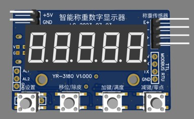
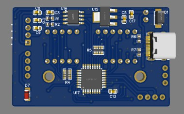

# Manual del Dispositivo YR-3180

## Descripción General

El módulo de pesaje YR-3180 es un equipo electrónico de pesaje multifuncional de alto rendimiento. Utiliza tecnología avanzada de sensores de pesaje para medir el peso de los objetos en tiempo real y mostrarlo en un tubo digital de cinco dígitos. Además, cuenta con funciones de alarma de límites superior e inferior. Es capaz de lograr un control y monitoreo de pesaje preciso. Este producto también tiene una interfaz de comunicación TTL y protocolo de comunicación MODBUS RTU, que permite una comunicación rápida y conveniente con computadoras PLC y otros equipos para la transmisión y control remoto de datos de pesaje. Además, soporta alimentación por USB Tipo-C y funciones de depuración con botones, mejorando la conveniencia y estabilidad de uso.

### Características principales

- Sensor de pesaje de alta precisión que permite una detección y visualización precisa del peso.
- Pantalla de tubo digital de cinco dígitos, intuitiva y clara, adecuada para procesos de pesaje de alta velocidad.
- Funciones de alarma de límites superior e inferior que facilitan advertencias tempranas y control estricto para mejorar la calidad.
- Soporte para interfaz de comunicación TTL y protocolo MODBUS RTU para una transmisión y control remoto de datos rápida y conveniente.
- Alimentación por USB Tipo-C/5V y función de depuración con botones, fácil de usar y con gran estabilidad.
- Ligero y portátil, fácil de instalar y mover, ahorrando espacio y costos.

## Dimensiones

## Instrucciones de Cableado

**Alimentación:**
- +5V: polo positivo
- GND: polo negativo

**Conexión de la interfaz del sensor:**
- E+: Excitación positiva 3.3V
- E-: Excitación negativa GND
- S+: Entrada de señal positiva
- S-: Entrada de señal negativa

**Interfaz de alimentación USB Tipo-C**

**Interfaz de comunicación TTL y protocolo MODBUS RTU:**
- 5V: polo positivo de salida de alimentación
- RX: Recepción de datos (recibe TXD de la otra parte)
- TX: Transmisión de datos (recibe RXD de la otra parte)
- GND: polo negativo de salida de alimentación

**Interfaz de alarma:**
- AL1: Alarma de límite superior
- AL2: Alarma de límite inferior
- Nivel bajo en caso de alarma

## Parámetros Generales

| Nº de serie | Símbolo | Área predefinida | Descripción | Valor predefinido en fábrica |
|-------------|---------|------------------|-------------|-----------------------------|
| 1           | Lock    | 0-99999          | Presione la tecla SEL para configuración, la ventana de visualización mostrará el mensaje LOCK y luego 1230. Solo después de cambiar a 1231 se pueden ingresar los siguientes parámetros. | 1230 |
| 2           | dot     | 0.0 0.00 0.000   | El sensor de 20kg se puede configurar con 3 puntos decimales 20.000kg El sensor de 200kg se puede configurar con 2 puntos decimales 200.00kg El sensor de 2000kg se puede configurar con 1 punto decimal 2000.0kg | 0.0 |
| 3           | LB      | 0-40             | 0-No procesamiento 1 a 40 veces de muestreo promedio de filtrado, cuanto mayor sea el valor de configuración, mejor será el efecto de filtrado pero la velocidad será más lenta. | 5 |
| 4           | Ad-H    | 01               | Velocidad de recolección: 0 baja velocidad 1 rápida | 0 |
| 5           | CLr     | 0-999.9          | El tara y rango de tara se borra al encender. Cuando este parámetro es mayor a cero, el medidor se borrará y tarará automáticamente dentro de este rango al encenderse. | 5 |
| 6           | Fd      | 1 2 5 10 20 50 100 200 | Valores de graduación opcionales: 1 2 5 10 20 50 100 200 | 1 |
| 7           | ZEro    | 0-9999           | Rango de seguimiento de cero, seguimiento automático del pesaje en el punto cero cercano para mantener la visualización del peso bruto en cero. Nota: La limpieza automática es inválida en modo automático. | 10 |
| 8           | Zt      | 10.0～600.0       | Tiempo de seguimiento de cero, unidad en segundos, el valor predeterminado de fábrica es 10 segundos. Por ejemplo: después de que el valor de peso se estabilice, no habrá cambio en el valor. Después de 10 segundos se borrará automáticamente. Después de que el valor cambie, reinicie el temporizador. | 60.0 |
| 9           | FSET    | 0.1000-9.9999    | Coeficiente de corrección valor de visualización = valor de visualización × 1.0000 | 1.0000 |

## Parámetros de Alarma

| Nº de serie | Símbolo | Área predefinida | Descripción | Valor predefinido en fábrica |
|-------------|---------|------------------|-------------|-----------------------------|
| 01          | LoCK    | 0-9999           | Presione la tecla SEL para configuración, la ventana de visualización mostrará el mensaje LOCK y luego 1230. Solo después de cambiar a 1232 se pueden ingresar los siguientes parámetros. | 1230 |
|             | AL      | PVL PVH PVHL OFF | PVL: Ambas AL1 y AL2 son alarmas de límite inferior. Si el valor medido es menor que el límite inferior, el relé se cerrará. PVH: Ambas AL1 y AL2 son alarmas de límite superior. Si el valor medido es superior al límite superior, el relé se cerrará. PVHL: AL1 es la alarma de límite superior, AL2 es la alarma de límite inferior OFF: Apagar la función de alarma | PVHL |
| 1           | AL1     | -1999.9-9999.9   | Valor de configuración de alarma de límite superior AL1. Cuando el valor medido exceda (50.0) el relé operará. Cuando el valor medido sea menor que 45.0 AL1 se desconectará. | 50.0 |
| 2           | AH1     | -1999.9-9999.9   | Valor de retorno de alarma de límite superior. | 5.0 |
| 3           | AL2     | -1999.9-9999.9   | Valor de configuración de alarma de límite superior AL2. Cuando el valor medido exceda (150.0) el relé operará. Cuando el valor medido sea menor que 145.0 AL1 se desconectará. | 150.0 |
| 4           | AH2     | -1999.9-9999.9   | Valor de retorno de alarma de límite superior. | 5.0 |

## Parámetros de Comunicación

| Nº de serie | Símbolo | Área predefinida | Descripción | Valor predefinido en fábrica |
|-------------|---------|------------------|-------------|-----------------------------|
| 01          | LoCK    | 0-9999           | Presione la tecla SEL para configuración, la ventana de visualización mostrará el mensaje LOCK y luego 1230. Solo después de cambiar a 1233 se pueden ingresar los siguientes parámetros. | 1230 |
| 02          | Addr    | 001-255          | Número de estación de comunicación Modbus | 001 |
| 03          | Baud    | 1200-115200kbps  | Velocidad de transmisión de datos del puerto de comunicación | 9600 |
| 04          | Pari    | None             | None: Sin dígito de verificación Odd: bit de paridad impar Even: bit de paridad par | 8N1 |
| 05          | Foalot  | 1234 2134 3412 4321 | Secuencia de datos: 12345678 42CAFB10; Secuencia de datos: 34127856 CA4201FB; Secuencia de datos: 56781234 FB1042CA; Secuencia de datos: 78563421 10FBCA42. | 123 |

## Calibración del Sensor

Para calibrar el sensor:
1. Mantenga presionada la tecla menos, no coloque peso sobre el sensor, presione la tecla de configuración para cambiar el valor a 0. Presione Set nuevamente para completar la calibración del punto cero.
2. Para calibrar la escala completa, mantenga presionada la tecla más, coloque el peso en el sensor, presione la tecla de configuración para cambiar el valor al peso correspondiente y presione Set nuevamente para completar la calibración de escala completa.

| Paso | Acción | Descripción |
|------|--------|-------------|
| 1    | AD     | Mantenga presionada la tecla menos, no coloque peso sobre el sensor, presione la tecla de configuración para cambiar el valor a 0. Presione Set nuevamente para completar la calibración del punto cero. |
| 2    | PL     | Introduzca el valor de peso correspondiente al valor del código de punto cero. No había peso en el sensor en este momento por lo que el valor está establecido en. . |
| 3    | -END   | Mostrar END indica que la calibración se completó y volverá automáticamente al estado de funcionamiento. |

| Paso | Acción | Descripción |
|------|--------|-------------|
| 1    | AD     | Para obtener el valor de muestreo AD a escala completa se debe colocar un peso en el sensor. Después de esperar 2 segundos presione el botón de configuración para guardar el valor de codificación de escala completa. (Más del 20% del alcance del sensor) |
| 2    | PH     | Ingrese el valor de peso correspondiente al valor de código de escala completa. Este valor se establecerá en el peso colocado en el sensor. Presione el botón de configuración para guardar. |
| 3    | -END   | Mostrar END indica que la calibración se completó y volverá automáticamente al estado de funcionamiento. |
